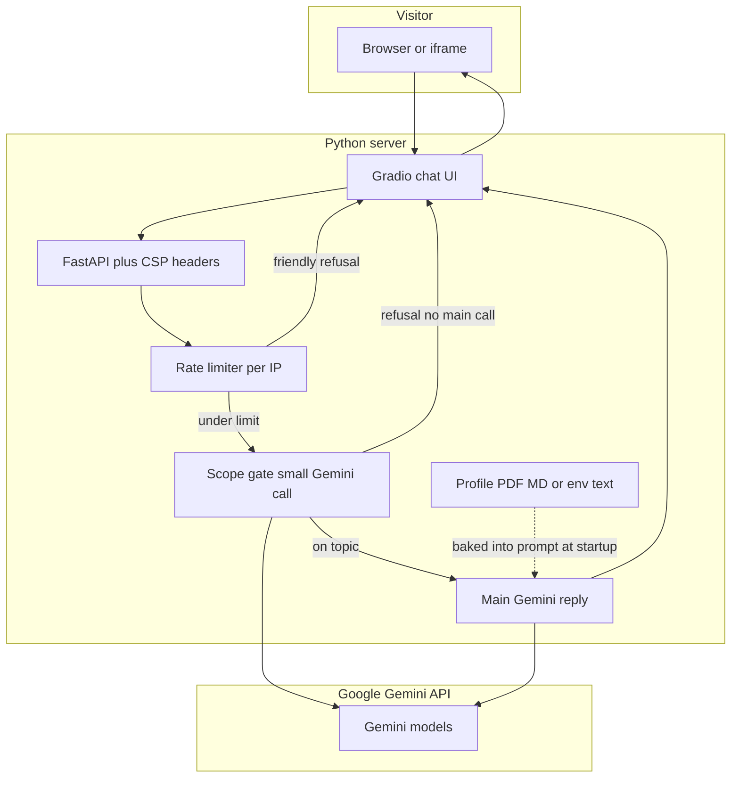

# Chat with my profile — portfolio assistant

Turn your **resume or LinkedIn PDF** into a small **“ask me anything (professional)”** widget for your site. This project runs a **Gradio** chat UI on **FastAPI**, uses **Google Gemini** to answer in **your voice** (first person), and only uses facts from **your profile file**. A **scope gate** blocks random questions; **rate limits** help control API cost.

**What you need:** Python 3.11+, [uv](https://docs.astral.sh/uv/), and a [Gemini API key](https://aistudio.google.com/apikey).

---

## How it works

At a high level, every message goes through **rate limiting**, then a **quick “is this about my career?” check** with Gemini. Only if that passes does the app call Gemini again for the **full answer**, still grounded in your profile text.



**Notes**

- **Profile** is read when the process starts (from `Profile.pdf`, another file, or `PROFILE_CONTEXT`). Restart after you change it.
- **Off-topic** questions never trigger the big reply model call (saves tokens).
- **Deploying** (e.g. Hugging Face) uses the [`Dockerfile`](Dockerfile): same app, same flow.

---

## Pick a setup

| I want to… | Jump to |
| ---------- | ------- |
| Run it on my laptop | [Local setup](#local-setup) |
| Host free on Hugging Face | [Hugging Face Spaces](#hugging-face-spaces-hosting) |
| Embed it in my portfolio site | [Iframe embedding](#embedding-in-your-portfolio-iframe) |

---

## Local setup

1. **Clone the repo** and open a terminal in the project folder.

2. **Install dependencies**

   ```bash
   uv sync
   ```

3. **Create your env file**

   ```bash
   cp .env.example .env
   ```

   Edit `.env` and set **`GOOGLE_API_KEY`** (or `GEMINI_API_KEY`). Tweak models and limits if you like — see [Configuration](#configuration).

4. **Add your profile**

   - Put **`Profile.pdf`** in the project root (text-based PDFs work best), **or**
   - Set **`PROFILE_PATH`** to another `.pdf`, `.md`, or `.txt`, **or**
   - Set **`PROFILE_CONTEXT`** to paste profile text (overrides the file).

5. **Start the app**

   ```bash
   uv run uvicorn app:app --host 0.0.0.0 --port 7860
   ```

   Or: `uv run python app.py`

6. Open **http://127.0.0.1:7860**

---

## Hugging Face Spaces (hosting)

Hugging Face hosts the app as a **Docker** Space. The Gradio “template” Space type is **not** used here — this app starts with **Uvicorn + FastAPI**.

### 1. Create the Space

1. Go to [**Create a new Space**](https://huggingface.co/new-space).
2. Choose **Docker** (not the Gradio SDK).
3. Template: **Blank**.
4. Hardware: **CPU Basic** is enough for a portfolio widget.
5. Visibility: **Public** if you want a link and iframe anyone can use.

Your Space gets **its own Git repo** on Hugging Face (it is **not** auto-linked to GitHub).

### 2. Add your API key (required)

On the Space: **Settings → Variables and secrets** → add:

- **`GOOGLE_API_KEY`** — your Gemini key

Optional (same names as [.env.example](.env.example)): `GEMINI_MODEL`, `FRAME_ANCESTORS`, `PROFILE_CONTEXT`, etc.

### 3. Push this code to the Space

From your computer, in a clone of **this** repository:

```bash
git remote add hf https://huggingface.co/spaces/YOUR_USERNAME/YOUR_SPACE_NAME
git push hf main
```

- Git will ask for credentials: use a [**Hugging Face access token**](https://huggingface.co/settings/tokens) (with write access), not your password.
- **First push often fails** with *“remote contains work you do not have”* because the Space was created with a tiny seed commit. **Overwrite only the Space** (safe for GitHub):

  ```bash
  git push hf main --force
  ```

After a successful push, Hugging Face **rebuilds** the Docker image. Watch **Build logs** if something fails.

### 4. Profile on the Space

- Commit **`Profile.pdf`** (or `profile.md`) in the repo you push to the Space, **or**
- Put the text in **`PROFILE_CONTEXT`** as a Space secret/variable (if multiline is supported for your account).

Rebuild after changing profile or secrets.

### 5. App URL and port

- Public URL: `https://huggingface.co/spaces/YOUR_USERNAME/YOUR_SPACE_NAME`
- The container listens on **7860** (see [`Dockerfile`](Dockerfile)); the YAML block at the top of this README sets `app_port: 7860` for the Hub.

### Keeping GitHub and Hugging Face in sync

There is **no** universal “Import from GitHub” button inside the Space UI. Common patterns:

- Add `hf` as a **second remote** and push to both `origin` and `hf`, or  
- Use [GitHub Actions → Hugging Face](https://huggingface.co/docs/hub/spaces-github-actions) to deploy on every push to `main`.

---

## Configuration

Environment variables drive the app. Locally, copy [.env.example](.env.example) to `.env`. On Hugging Face, use **Settings → Variables and secrets**.

| Variable | Purpose |
| -------- | ------- |
| `GOOGLE_API_KEY` / `GEMINI_API_KEY` | Gemini API authentication (`GOOGLE_API_KEY` wins if both are set). |
| `GEMINI_MODEL` | Main chat model (default `gemini-2.5-flash`). |
| `SCOPE_GATE_MODEL` | Cheaper/smaller model for allow/refuse (defaults to `GEMINI_MODEL`). |
| `PROFILE_PATH` | Profile file relative to project root (default `Profile.pdf`). |
| `PROFILE_CONTEXT` | If set, used instead of the file. |
| `MAX_MESSAGE_CHARS` | Max user message length. |
| `MAX_OUTPUT_TOKENS` | Max length of each assistant reply. |
| `CHAT_TEMPERATURE` | Creativity for main replies (default `0.65`). |
| `SCOPE_GATE_MAX_OUTPUT_TOKENS` | Cap for gate JSON output. |
| `RATE_LIMIT_MAX_MESSAGES` / `RATE_LIMIT_WINDOW_SECONDS` | Sliding-window rate limit per IP. |
| `FRAME_ANCESTORS` | Sites allowed to embed your app (comma-separated, or `*` for any). **`https://huggingface.co`** is **always appended** automatically (unless you use `*`) so the Space **App** tab on Hugging Face keeps working—Hugging Face loads `*.hf.space` inside an iframe on `huggingface.co`. |
| `HOST` / `PORT` | Used when running `python app.py` locally. |

Model names and billing: [Gemini models](https://ai.google.dev/gemini-api/docs/models) · [Pricing](https://ai.google.dev/gemini-api/docs/pricing).

---

## Embedding in your portfolio (iframe)

The app sends **`Content-Security-Policy: frame-ancestors …`** and removes **`X-Frame-Options`** when present so your portfolio can embed it. Your `FRAME_ANCESTORS` list is merged with **`https://huggingface.co`** and **`https://www.huggingface.co`** by default so the Space still loads on [the Hugging Face website](https://huggingface.co/spaces); without that, the hub’s own iframe is blocked by your CSP.

1. Serve the app over **HTTPS** (Hugging Face Spaces does this automatically).
2. Set **`FRAME_ANCESTORS`** to your real origins, e.g.

   ```env
   FRAME_ANCESTORS=https://yourdomain.com,https://www.yourdomain.com
   ```

3. Example embed:

   ```html
   <iframe
     src="https://your-chat-host.example/"
     title="Profile assistant"
     loading="lazy"
     style="width:100%;min-height:640px;border:0;border-radius:8px"
   ></iframe>
   ```

If the iframe is blank, check the browser **Console** for CSP or mixed-content errors.

---

## Project layout

| Path | Role |
| ---- | ---- |
| [app.py](app.py) | Gradio UI, Gemini calls, FastAPI mount, iframe-friendly headers |
| [config.py](config.py) | Settings; loads profile from PDF / MD / TXT / env |
| [guardrails/scope.py](guardrails/scope.py) | Scope gate (profile-related questions only) |
| [limits/ratelimit.py](limits/ratelimit.py) | Sliding-window rate limit |
| [Dockerfile](Dockerfile) | Production / Hugging Face image |
| [pyproject.toml](pyproject.toml) · `uv.lock` | Dependencies (**uv**) |
| `.env.example` | Copy to `.env` locally |

---

## Tips and caveats

- **Two Gemini calls** per allowed message (gate + main). Off-topic input stops after the gate.
- **Restart** the server after changing the profile file or `PROFILE_CONTEXT`.
- **Image-only PDFs** may yield almost no text; prefer exported text PDFs or Markdown.
- Do **not** commit `.env` or API keys. Treat **`Profile.pdf`** as sensitive if it contains PII.
